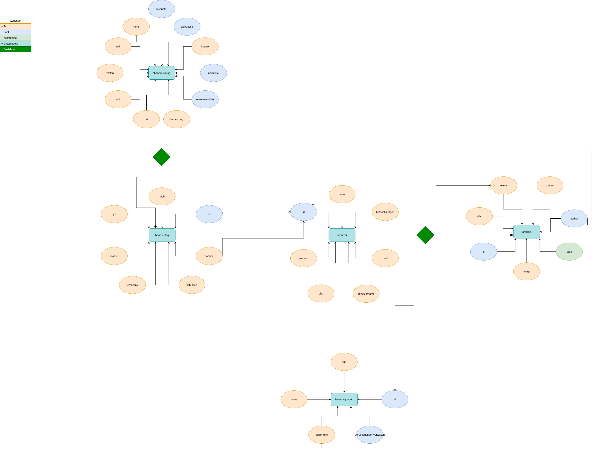

# kantiges-schulleben
* [Beschreibung](#Beschreibung)
* [Datenbankstruktur](#Datenbankstruktur)
* [Endpunkte](#Endpunkte)
    * [/blog](#/blog)
        * [get.php](#get.php)
        * [saveArticle.php](#saveArticle.php)
        * [search.php](#search.php)
    * [/my](#/my)
        * [changePassword.php](#changePassword.php)
        * [getDashboardData.php](#getDashboardData.php)
    * [/shs/anmeldung](#/shs/anmeldung)
        * [save.php](#save.php)
    * [/signup](#/signup)
        * [signup.php](#signup.php)
        * [checkUsernameExists.php](#checkUsernameExists.php)
* [Kristian](#Kristian)

### Beschreibung
Eine wundervolle Seite für Schüler:Innen des Kantgymnasiums.

[zur Website](https://www.kantiges-schulleben.de)

### Datenbankstruktur

### Endpunkte
#### /blog
##### get.php
* Parameter
    * id
* Rückgabe(json/mehrdimensional)
    * wenn id angegeben
        * title
        * content
        * image (name der Datei in /images)
        * date (YYYY-MM-DD HH:MM:SS)
        * id
        * name (name des zugehörigen blogs)
    * wenn id nicht angegeben und name als getparameter angegeben ist
        * title
        * content (die ersten 256 zeichen des artikels)
        * image (name der Datei in /images)
        * date (YYYY-MM-DD HH:MM:SS)
        * id
        * name (name des zugehörigen blogs)
    * wenn id und name nicht angegeben sind werden alle blogs zurückgegeben
        * name (name des blogs)

##### saveArticle.php
* Parameter
    * title
    * content
    * blogname
    * imagefile (über dateiupload nicht post)
* Rückgabe (json/eindimensional)
    * success (true wenn erfolgreich, sonst false)
    * message (wenn success = false, dann fehlertext, sonst nicht vorhanden)

##### search.php
* Parameter
    * mode
        * 1 -> suche in titel
        * 2 -> suche in text
        * 3 -> suche in text und tite
    * key (zu suchender text)
    * blogname (nur wenn in einem bestimmten blog gesucht werden soll, sonst * werden alle treffer zurückgegeben)
* Rückgabe (json/mehrdimensional)
    * title
    * content (die ersten 256 zeichen des artikels)
    * image (name der Datei in /images)
    * date (YYYY-MM-DD HH:MM:SS)
    * id
    * name (name des zugehörigen blogs)

#### /my
##### changePassword.php
* Parameter
    * oldPassword
    * newPassword
* Rückgabe (json/eindimensional)
    * success (true wenn erfolgreich; false bei fehler)
##### getDashboardData.php
* Parameter
    * *keine*
* Rückgabe (json/eindimensional)
    * bei Erfolg
        * success (true)
        * fach
        * klasse
        * me (eigener Name)
        * partner (Name des Partners)
    * bei Fehler
        * success (false)

#### /shs/anmeldung
##### save.php
* Parameter
    * name
    * klasse
    * mail
    * telefon
    * nachhilfe (0 wenn nehmen, 1 wenn geben)
    * fach (Fächernamen mit semikolon getrennt)
    * zeit (dezimaldarstellung von binärzahl; aufbau: erste stelle immer 1,     danach montag_dritterBlock, montag_vierterBlock, dienstag_dritterBlock, ...     [natürlich ohne kommas] -> 1 = "ich kann" & 0 = "ich kann nicht")
    * einzelnachhilfe (0 wenn einzelnachhilfe; 1 wenn gruppennachhilfe
    * ziel (klassenstufe, für die man nachhilfe geben möchte)
    * bemerkung (optional)
* Rückgabe (json/mehrdimensional)
    * success (true wenn erfolgreich; false bei fehler)
    * message (wenn false fehlertext)

#### /signup
##### signup.php
* Parameter
    * name
    * username
    * password
    * mail (optional)
* Rückgabe (json/eindimensional)
    * success (true wenn erfolgreich; false bei fehler)
    * message (wenn false fehlertext)
##### checkUsernameExists.php
* Parameter
    * username
* Rückgabe (json/eindimensional)
    * exists (true, wenn bereits existent; false, wenn noch verfügbar)